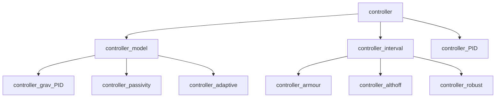

# Controllers

Different controller implementations and their inheritance relationships:

```mermaid
graph TD
    A[controller]
    A --> B[controller_model]
    A --> C[controller_interval]
    A --> I[controller_PID]
    B --> K[controller_grav_PID]
    B --> D[controller_passivity]
    B --> E[controller_adaptive]
    C --> F[controller_armour]
    C --> G[controller_althoff]
    C --> H[controller_robust]
```